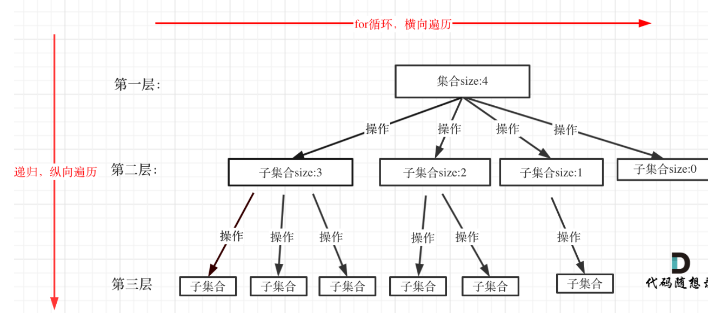

### 一、回溯经典模版

1. 回溯法都可以抽象为树形结构，查找时：集合的宽度是树的宽度（有多少子树），递归深度为树的深度
2. 回溯模版：

   

```
void backtracking(参数) {
    if (终止条件（一般就是叶子节点收集结果）) {
        存放结果;
        return;
    }

    for (选择：本层集合中元素（树中节点孩子的数量就是集合的大小）) {
        处理节点;
        backtracking(路径，选择列表); // 递归
        回溯，撤销处理结果
    }
}
```

2.回溯的三种常见套路：

- 进门直接处理（这样pop会滞后一层，相当于综合算式，在父节点那里处理），不是标准push+递归+pop，在父节点push，但是还是需要pop；这个方法能直接处理整个二叉树，不需要单独处理根节点

  ```
  void traversal(TreeNode* cur) {
      path.push_back(cur->val); // 【动作1】只要进这扇门，就把自己放进去

      if (cur->left) {
          traversal(cur->left); // 【动作2】递归：去开下一扇门
          path.pop_back();      // 【动作3】回溯：把刚才那扇门里放的东西拿出来
      }
  }
  ```
- 标准模版：一个push一个pop，在同一层处理，相当于分步算式；但是需要单独处理根节点，因为这个方法不能处理根节点

  ```
  void traversal(TreeNode* cur) {
      // 假设 cur->val 已经在进门前由父节点放好了
      if (cur->left) {
          path.push_back(cur->left->val); // 【动作1】我要开左门了，先把左孩子放进去
          traversal(cur->left);           // 【动作2】递归
          path.pop_back();                // 【动作3】回溯：我亲手放的，我亲手拿出来
      }
  }
  ```
- 值传递：不需要显式回溯，cpp自动处理回溯的逻辑（创建新变量不影响这个变量的值）相当于创建一个新的(int new_sum=sum--)

  ```
  bool hasPathSum(TreeNode* root, int count) {
      if (!root) return false;
      count -= root->val; // 进门就减，但 count 是传值，不是引用
      if (!root->left && !root->right) return count == 0;

      // 左右递归时，count 会自动产生副本，回来时原值不变
      return hasPathSum(root->left, count) || hasPathSum(root->right, count);
  }
  ```
